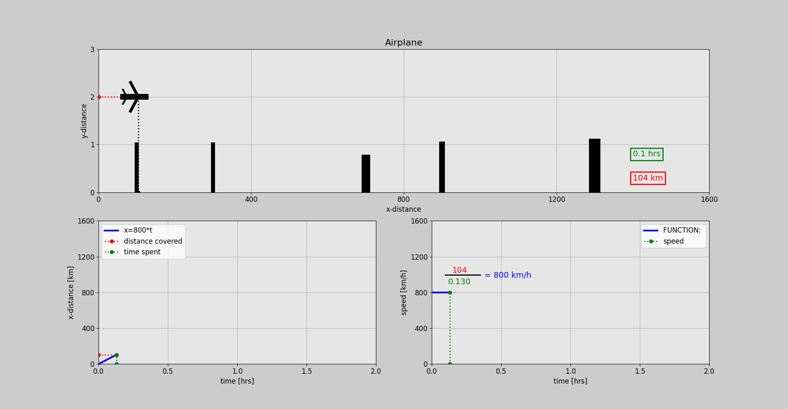

# 1. Airplane One Dimension

Project focused on animating the motion of an airplane in one dimension. The project demonstrates the use of Python to animate the airplane's velocity and position over time, utilizing libraries like Matplotlib and Plotly for visualization. The code provided showcases how to dynamically update graphical elements to reflect changes in data over time, offering a practical example of creating 1D animations and modeling physics in Python.

## Files

