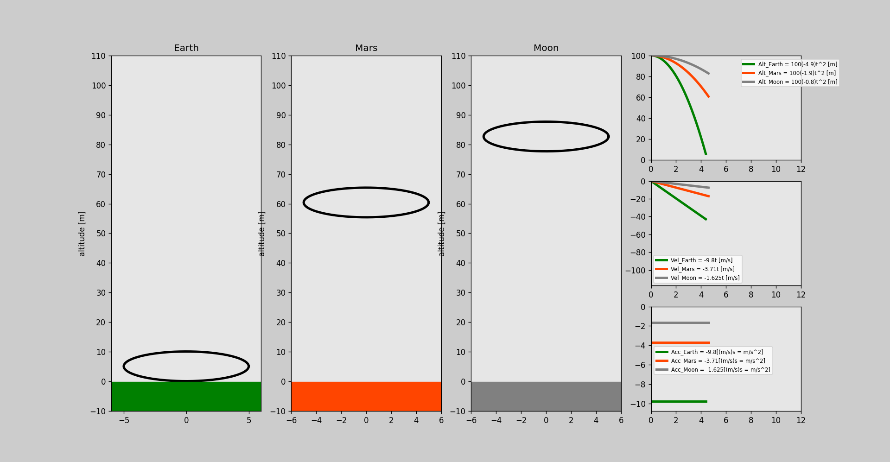

# 2. Free Fall

This project show a free fall of an object in 3 different planets (earth, mars and moon), using the basic laws of physics not consinder air resistence.

## Files

- [Code](free_fall.py)
