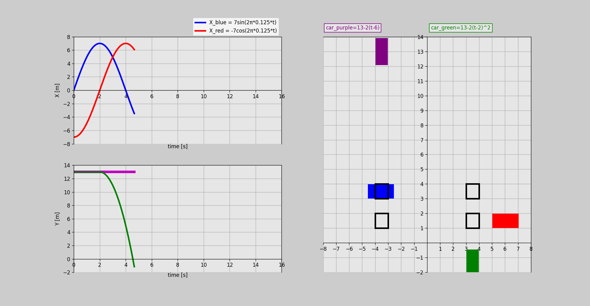

# 3. Cars

This project demonstrates a simple 2D animation where two cars and two trains move across the screen. Each object is represented as a block and follows its own function, ensuring they do not collide with each other.

## Files

- __[Cars 1](cars.py)__ - original main file.

- __[Cars 2](cars.py)__ - just modified functions of trains.
